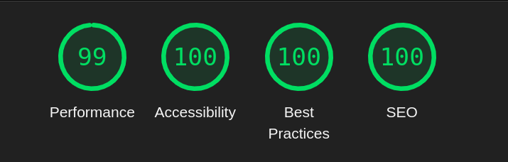

# 🛍️ Front-End Online Store with a Modern Design
This project is a product showcase website featuring a modern design using the **Tailwind CSS Framework.**

---
## Live Demo Link
[ Live Demo Link](https://wolfhx9.github.io/Jewelry/)

---

## 📸 Screenshot of the Project
  

---

## 🚀 Technologies Used

- Tailwind CSS
- Font Awesome icons
- Google Fonts
- Owl Carousel 2
- Animate.css && WOW.js
- jquery

---

## ⚡ Performance  
  

---

## ✨ Features
✅ Fast and responsive design for all devices
✅ Smooth effects and dynamic animations with Tailwind CSS
✅ Smooth animations
✅ Clean and easily editable code
✅ Great user experience with an elegant interface

---

## Installation

1. Clone the repository
```sh
git clone https://github.com/wolfhx9/Jewelry.git
``` 
2. Install the dependencies
3. Run the development server

---

## 📦 Sources Used
- **📌 Design:** Taken from [Dribbble](https://dribbble.com)  
- **📷 Photos:** From [Freepik](https://www.freepik.com/)  
- **🔤 Fonts:** Taken from [Google Fonts](https://fonts.google.com/)  
- **🖼️ Improve image quality:** [Arkthinker](https://www.arkthinker.com/ar/image-upscaler/)  
- **🗑️ Remove background from images:** [Remove.bg](https://www.remove.bg/)
- **🎭 Animations From** [Animate.css](https://animate.style/) && [WOW.js](https://wowjs.uk/)
- **📌 Carousel** [Owl Carousel 2](https://owlcarousel2.github.io/OwlCarousel2/)

---

## 📜 Licensing  
Licensed under the MIT License – you may use it freely as long as you credit the source.